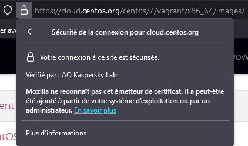
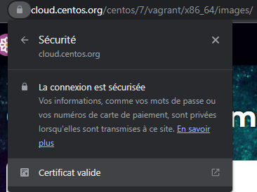
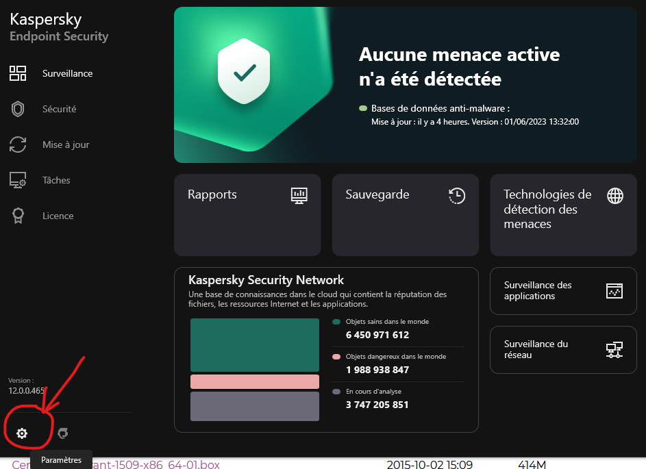
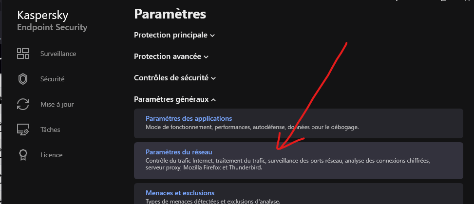
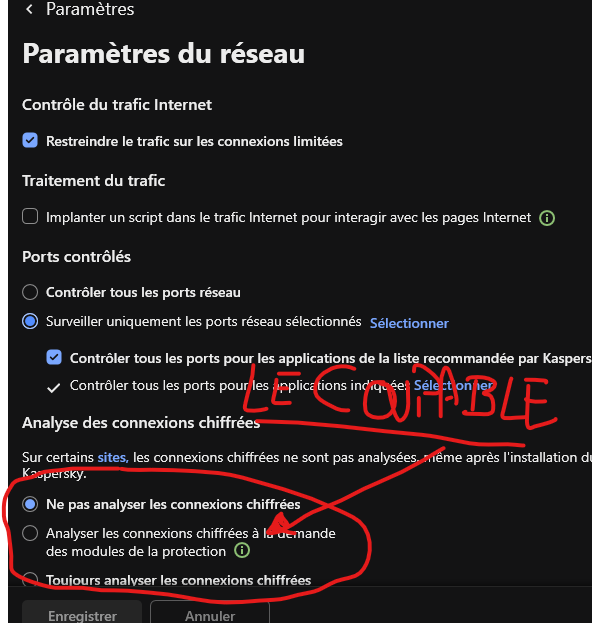
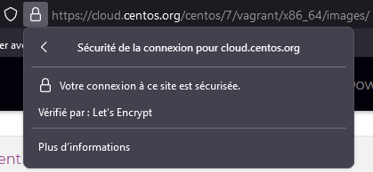

## Kaspersky fait n'importe quoi
Cette histoire de certificat auto-signé me chagrinait, la solution qu'on a appliquée pour pouvoir télécharger nos images est absolument horrible point de vue sécurité : on dit à Vagrant de pas s'alarmer si le certificat SSL fourni par le serveur où on télécharge l'image linux est mauvais, alors que c'est précisément un des cas où Vagrant **doit s'alarmer**. Pourquoi ? Parce que s'il rencontre un certif auto-signé, ça peut signifier qu'on ne tape pas le bon serveur et qu'un plaisantin est en train de nous filer **une image linux vérolée**.

Je suis donc allé voir sur [Vagrant Cloud](https://app.vagrantup.com/) où il récupérait les images, et j'ai vu que par exemple pour CentOS il les prend sur https://cloud.centos.org/ qui est le canal officiel de release de CentOS, donc ça semblait assez fiable de base.  

Oui mais voilà :  
  

Firefox qui ne reconnaît pas un éditeur de certificats c'est tout de suite un peu plus inquiétant... On note que ça ne pose pas de problème à Chrome étrangement :  
  

Il y a une raison à ça. Chrome prend les certificats directement dans la base de Windows, alors que Firefox a son propre store de certificats.  

*Mais pourquoi Firefox ne ferait pas confiance à un éditeur de certificats que Windows accepte sans broncher ?*  

La réponse, c'est qu'on peut ajouter des éditeurs de confiance à la main dans Windows **si on a les droits d'admin** sur la machine... Et là Firefox a raison de s'affoler, parce que c'est le genre de manips que font les virus pour nous envoyer sur des sites de phishing, donc grosse brèche de sécu potentielle.  

## On se calme, on respire
Bon, vous vous en doutez, on n'a pas tous chopé un malware qui nous file des faux certifs pour capter notre trafic ou autre joyeuseté, le coupable est bien plus proche de nous et il veut plus ou moins notre bien puisque c'est **Kasperky**, notre antivirus.  

*"Euh ok mais c'est quoi le but de nous coller des certificats auto-signés à la place du certificat original du site ?*  

Pour être tout à fait honnête, je sais pas trop.  

J'ai fait pas mal de recherches avant d'arriver là, et le consensus ce serait que Kaspersky intercepte notre trafic internet pour vérifier qu'on va pas sur un site vérolé. Sauf que pour faire ça sans que le navigateur pète un plomb, ben il est obligé de remplacer le certif original par un autre, que Kasperky génère lui-même à la volée et qui est donc auto-signé, ce qui en retour fait paniquer toutes nos applis qui ne se basent pas sur Windows pour authentifier les éditeurs de confiance.  

## Bon c'est bien mignon tes explications mais tu m'as saoulé, comment on vire cette m\*\*\* ?
J'y viens c'est bon détendez-vous !  
La première étape, c'est d'ouvrir Kaspershyt et d'aller dans ses paramètres :  
  

Ensuite c'est direction *"Paramètres Généraux/Paramètres du Réseau"* :  

Enfin on va dans la section *"Analyse des connexions chiffrées"* et on passe de *"Analyser les connexions chiffrées blablabla osef"* à **Ne pas analyser les connexions chiffrées** :  

On valide, et Kaspersky va sortir une alerte du genre *"Vous êtes sûr que vous voulez faire ça ?"*, on passe outre parce que c'est pas une machine qui va nous dire quoi faire, on actualise notre page cloud.centos.org et...  
  

Ce qui conclut mes folles recherches pour ce soir, avec en prochaine étape de virer notre solution de contournement et écraser l'image pour que Vagrant la télécharge à nouveau histoire de tester que tout ça fonctionne désormais bien.

En cadeau de remerciement pour avoir lu mes élucubrations jusqu'au bout, une image d'une loutre trop choupi parce que j'adore les loutres :  

